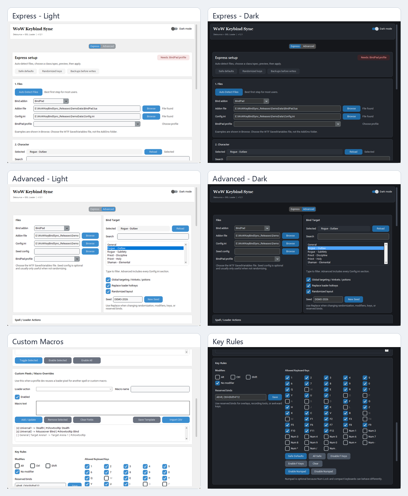

# WoW Keybind Sync

Windows utility for generating matching keybinds between a loader `Config.ini` and an in-game bind addon file.

The app is built around a preview-first workflow:

1. Choose Debind, Debounce, or BindPad.
2. Select the addon SavedVariables file and `Config.ini`.
3. Pick a class/spec.
4. Preview the generated keybind plan.
5. Apply after closing WoW and the loader.

## Current Features

- Express setup for quick configuration.
- Advanced tab for full control.
- Debind, Debounce, and BindPad support.
- Debind is the current name of the Debounce addon (3.x); it stores settings in `SavedVariables\Debind.lua`. Old `Debounce.lua` files are detected and neutralized on Apply so Debind's one-time migration cannot overwrite new binds.
- Class/spec action loading from `Config.ini`.
- Spell/action toggles per class/spec.
- Custom macro CSV import and template export.
- Custom pixel/macro overrides.
- Optional Config.ini `[General]` binds, including targeting, stopcasting, trinkets, healthstone, potions, and other General actions.
- General actions are discovered from the loaded Config.ini instead of a fixed action allowlist; NumPad 5 label variants are normalized when reading loader data.
- NumPad guidance explains that NumPad 5 and the NumLock-off `CLEAR`/`NUMPADCLEAR` labels are the same physical key.
- When NumPad keys are selected, preflight reports the current NumLock state and Apply asks for confirmation if NumLock is off.
- Randomized bind layouts with repeatable seeds.
- Modifier and key-pool controls, including numpad and function-key toggles.
- Keyboard layout profiles, including US QWERTY, German QWERTZ, and International Safe.
- Preview CSV reports before writes.
- Backups before Apply and cleanup writes.
- Scoped cleanup for the selected Config.ini section and/or bind addon target, with backups and post-write verification.
- Renamed-loader detection based on the selected `Config.ini` folder, plus an optional explicit loader path.
- File-in-use checks, post-write verification, and automatic rollback when an Apply fails.
- Preflight setup checks.
- Backup manager.
- Redacted support bundle export for bug reports.
- Light/dark mode.

## Screenshots



## Install For Users

Download the latest release `.exe` from GitHub Releases once public releases are published.

Do not run Apply while WoW or the loader is open.

## Run From Source

Install Python 3.11+ on Windows, then:

```powershell
python -m venv .venv
.\.venv\Scripts\Activate.ps1
python -m pip install -r requirements.txt
python src\wow_keybind_app.py
```

## Build EXE Locally

```powershell
.\scripts\build.ps1
```

The built `.exe` will be placed in `dist\` by PyInstaller.

## Privacy Notes

The app stores local paths in `wow_keybind_sync_settings.json`. That file is ignored by Git and should not be shared.

The support bundle export redacts common local paths before packaging logs/settings.

## Reporting Bugs

Please include:

- app version
- class/spec
- Debind, Debounce, or BindPad
- Express or Advanced
- what action failed
- whether Preview showed a key
- exported support bundle or preview CSV when possible

## Source Transparency

Source is included so users can inspect what the app writes before running it.
